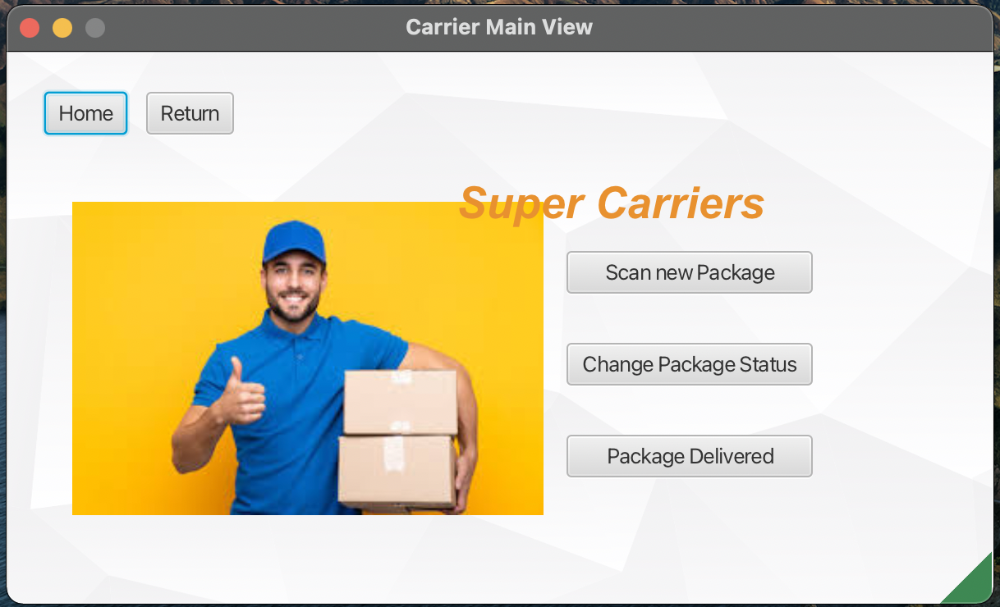

<h1 align="center"> Delivery Manager</h1>

A Delivery Management System as the final project of NEU course CSYE6200 Concepts of Object-Oriented Design.  

<!-- TOC -->
* [📑 Overview](#-overview)
* [💻 Environment](#-environment)
* [🛠 Installation](#-installation)
* [🚀 Technologies](#-technologies)
<!-- TOC -->

# 📑 Overview
Created a Delivery Management System using JavaFX for delivery folks and recipients. It ensures on-time delivery notifications until users confirm receipt. You can track packages in real-time and get automatic updates. The system also allows you to customize notification preferences, confirm deliveries, and provide feedback to improve the process. It's designed to make deliveries smoother and keep users informed.

<h3 align="left">Main Pages</h3>

<h3 align="left">Functions for Carrier</h3>

<h3 align="left">Functions for Recipient</h3>

# 💻 Environment
1. [JavaFx](https://openjfx.io/), tutorial [Getting Started](https://openjfx.io/openjfx-docs/)

2. [SceneBuilder](https://gluonhq.com/products/scene-builder/)

# 🛠 Installation
1. Clone the repository into your local machine
2. Download [JavaFX SDK](https://gluonhq.com/products/javafx/) and [MySQL](https://dev.mysql.com/downloads/installer/)

# 🚀 Technologies
This project was developed with the following technologies:
- JavaFX
- MVC design pattern
- MySQL
- SceneBuilder
- Eclipse
  
OOD/OOP concepts used:
- Inheritance/Polymorphism
- Abstract Classes/Interfaces
- Generics/Collections/Iterators

Data structure used:  
- Lists, Stacks, Queues/Priority Queues, Set/MapsGraph

Other tools used:  
- Git&GitHub
- Google Drive
- Trello team/tasks management

[⬆ Back to the top] 

© Muyun Ji. Confidential and Proprietary. All Rights Reserved.

